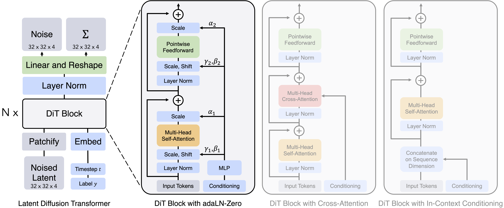
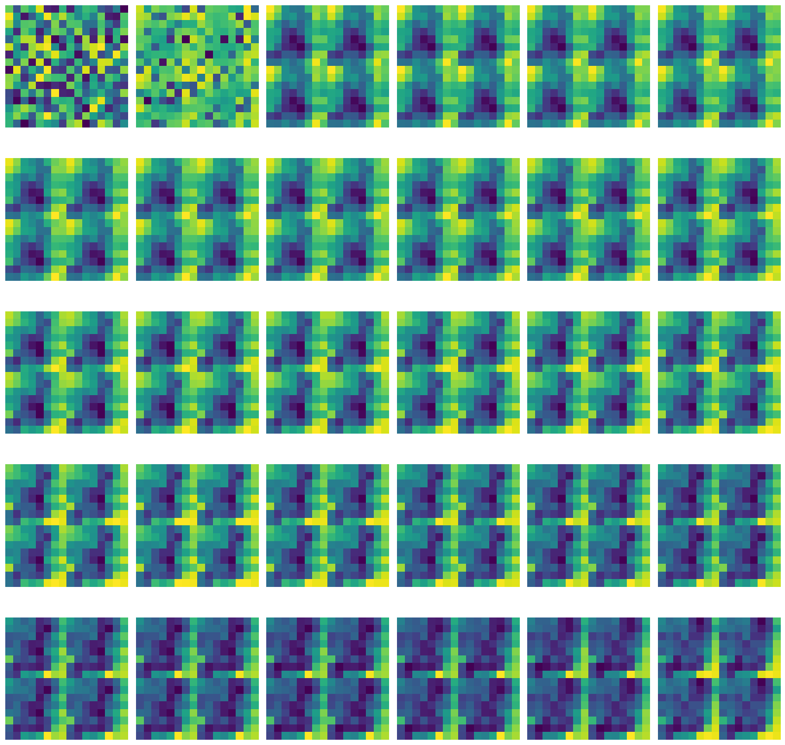

# Simple Diffusion Transformer

Diffusion Transformer(Dit) Model Architecture:


## Usage

#### Dependencies
```bash
pip install pip install torch torchvision safetensors pillow opencv-python matplotlib
```

#### Run
```powershell
python main.py
```

#### Instructions
if main.py run successfully would be like:
<video controls src="outputs/tutorials.mp4" title="Title"></video>

## Update

Model train loop
```python
Epoch 1/500: 100%|██████████| 200/200 [01:38<00:00,  2.02it/s, loss=0.414]
Epoch 2/500: 100%|██████████| 200/200 [01:39<00:00,  2.02it/s, loss=0.201]
Epoch 3/500: 100%|██████████| 200/200 [01:39<00:00,  2.01it/s, loss=0.178]
...
Epoch 360/500: 100%|██████████| 200/200 [01:36<00:00,  2.08it/s, loss=0.0958]
Epoch 361/500: 100%|██████████| 200/200 [01:36<00:00,  2.07it/s, loss=0.0864]
Epoch 362/500: 100%|██████████| 200/200 [01:36<00:00,  2.07it/s, loss=0.0859]
Epoch 363/500:  36%|███▌      | 72/200 [00:38<01:07,  1.89it/s, loss=0.077]
```
### TODO
❌ Output three channel model(use RGB image dataset to train)

❌  Enhance model capability use cross-attention mechanism for semantic understanding

❌ Deal with same unknown bug for dit model
- when patch size > 1, in low training process, model generate noise is repeated subgraphs following:

- when use function `load_model`, pass if model already loaded will generate error image be like:

---
### DONE
✅ A simple diffusion transformer implement


✅ Graphical interface for generating one-channel image for handwritten number

## Acknowledgement
dit model code based on the code following [repository](https://github.com/owenliang/mnist-dits/tree/main). The Graphical interface code based on the code following [repository](https://github.com/mehmet-mert/FrameRecorder).   mnist dataset from [huggingface](https://huggingface.co/datasets/ylecun/mnist). diffusion model mechanism following [wiki](https://en.wikipedia.org/wiki/Diffusion_model).

Thanks to the [author](https://github.com/owenliang) and [author](https://github.com/mehmet-mert) for their open source projects